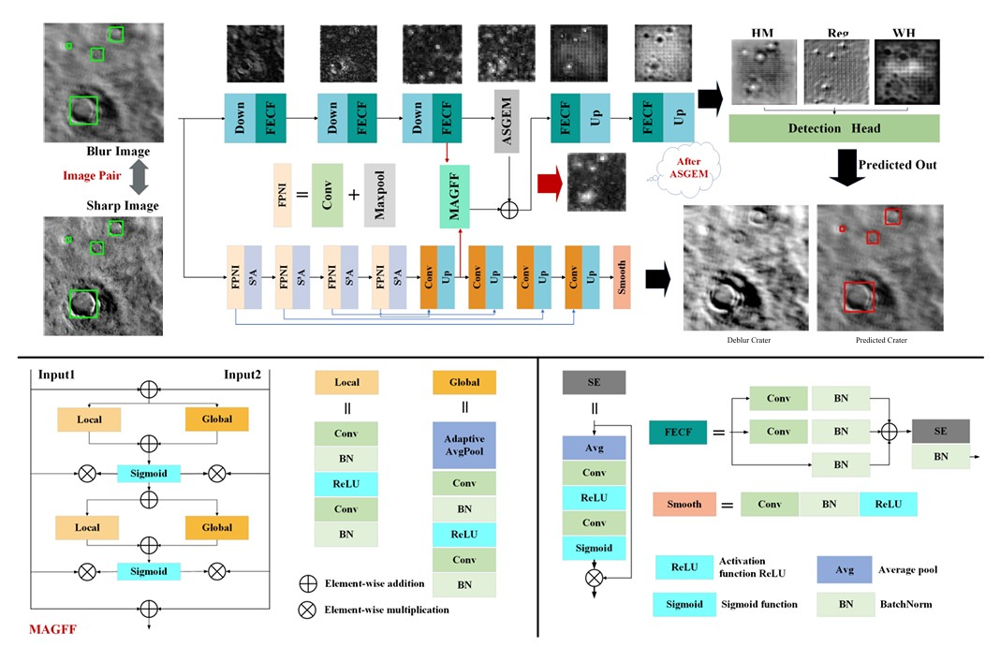
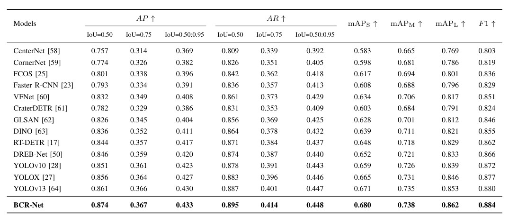
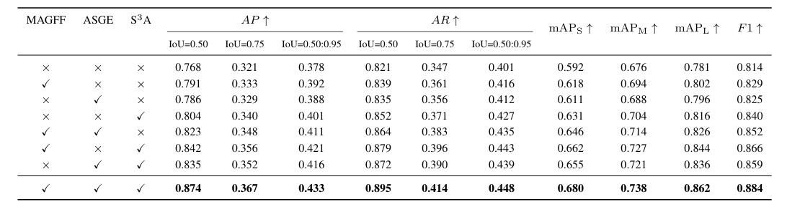
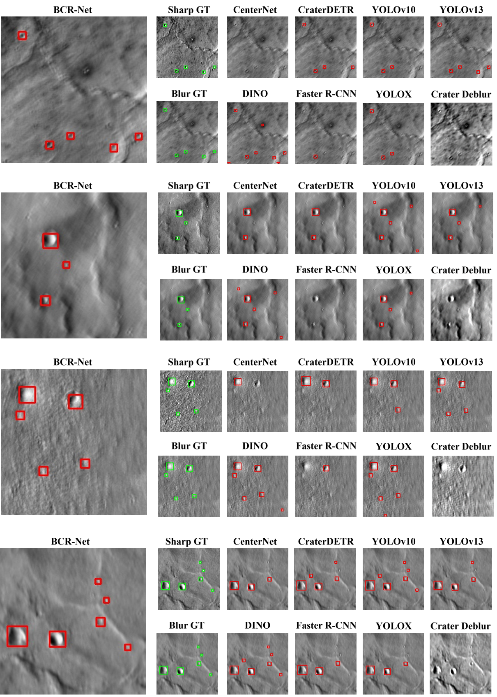

# BCR-Net: Blurred Crater Recognition Based on Dual-Branch Attention and State-space Learning for Motion-Affected Martian Remote Sensing Imagery

## Abstract

Martian planetary landers are highly susceptible to motion blur during descent due to airflow disturbances and rapid attitude variations, resulting in degraded image quality and disrupted spatial continuity. Although blur-aware object detection has been explored in terrestrial imaging scenarios, it remains largely underexplored for extraterrestrial remote sensing imagery due to the lack of dedicated datasets.

To bridge this gap, a **Blurred Martian Crater Dataset (BMCD)** is constructed, and a dual-branch framework, termed **Blurred Crater Recognition Network (BCR-Net)**, is proposed for robust crater detection under degraded imaging conditions. The framework incorporates an auxiliary blur restoration branch to compensate for information loss and enhance feature representation.

Specifically, a **Multi-level Attention-Guided Feature Fusion (MAGFF)** module is developed to enable adaptive cross-branch feature interaction by jointly exploiting local and global contextual cues. Furthermore, a **Spatially Selective State-space Attention (S$^{3}$A)** mechanism is introduced to model distance-aware spatial dependencies in crater distributions, capturing both short- and long-range relationships under blur degradation. In addition, an **Adaptive Spatial Gaussian Enhancement (ASGE)** module is proposed to strengthen crater boundary representations and recover fine-grained textures via adaptive Difference-of-Gaussians operations, thereby mitigating blur-induced boundary diffusion.

Extensive experiments on the **BMCD** test dataset demonstrate that the proposed method consistently outperforms existing approaches. In particular, the detection accuracy for small-scale craters improves from **59.2%** to **68.0%**, achieving an **F1-score of 88.4%** and a **precision of 87.4%**.

## Overall Framework

BCR-Net is a dual-branch framework designed for motion-blurred object detection, consisting of a blur restoration branch and an object detection branch. A MAGFF module is introduced to enable lightweight local and global attention-based feature fusion between the two branches, promoting complementary information exchange under blurred conditions. Furthermore, the proposed ASGEM and S$^{3}$A modules are employed to enhance feature representation and improve detection performance. The overall architecture of BCR-Net is illustrated below.

<div align="center">
    <a href="./">
        
    </a>
</div>


## Quantitative Evaluation

Quantitative evaluation results on the BMCD dataset using different methods. The best performance for each metric is highlighted in **bold**.

<div align="center">
    <a href="./">
        
    </a>
</div>

## Ablation Study

To verify the contribution of different components in BCR-Net, ablation experiments are conducted on the BMCD dataset. The effectiveness of the proposed modules is evaluated through quantitative comparisons, with the best performance highlighted in **bold**.

<div align="center">
    <a href="./">
        
    </a>
</div>


## Usage

Installation： 
``` shell
conda create -n BCR-Net python=3.12.3
conda activate BCR-Net
pip install -r requirements.txt
```

Data preparation:
``` shell
python tools/gen_motion_blur/blur_image_crater.py
```

train:
``` shell
sh bash/train_crater.sh
```

evaluation:
``` shell
sh bash/evaluation_crater.sh
```


## Results

Performance comparison of different methods on the **BMCD** test dataset. The following results demonstrate the effectiveness of the proposed **BCR-Net** in crater detection under motion-blurred conditions.

<div align="center">
    <a href="./">
        
    </a>
</div>

